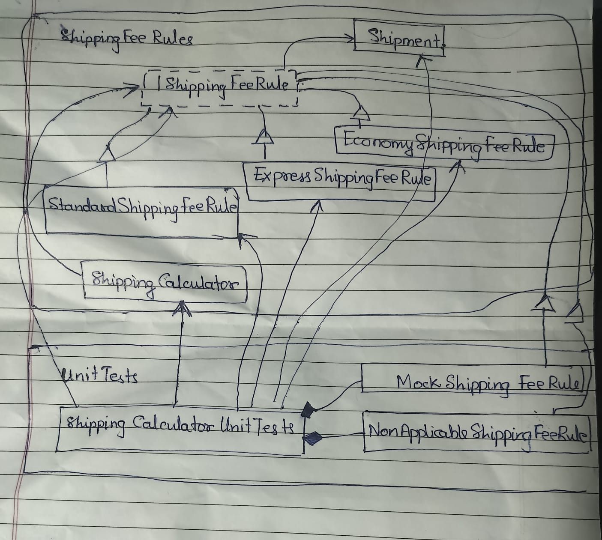

# assign-1-a20-shipping-fee-rules

# Overview

This project demonstrates the **Open/Closed Principle (OCP)** from SOLID design principles.

A **shipment** represents a collection of goods identified by its `WeightKg` and `ServiceLevel`. It is represented as a public, sealed, immutable record, providing value-based equality.

# Design

The project defines an `IShippingFeeRule` interface as the extension point for shipping-fee calculations.

Three independent rules are implemented:

* `StandardShippingFeeRule`
* `ExpressShippingFeeRule`
* `EconomyShippingFeeRule`

Each rule is responsible for determining whether it applies to a shipment and calculating its fee. Keeping the rules independent means a rule can be changed or a new rule can be added without modifying the existing rules or the calculator.

`ShippingCalculator` receives a collection of `IShippingFeeRule` implementations, finds the **first applicable rule**, and delegates the fee calculation to it. It contains no service-specific conditionals.

The tests verify the existing rules, rule selection, non-applicable rules, unmatched shipments, null handling and that a new test rule can be added without modifying `ShippingCalculator`.

# Environment

The project builds and runs with **Visual Studio Community 2026 (2022 may also work)** with the required workloads installed.
